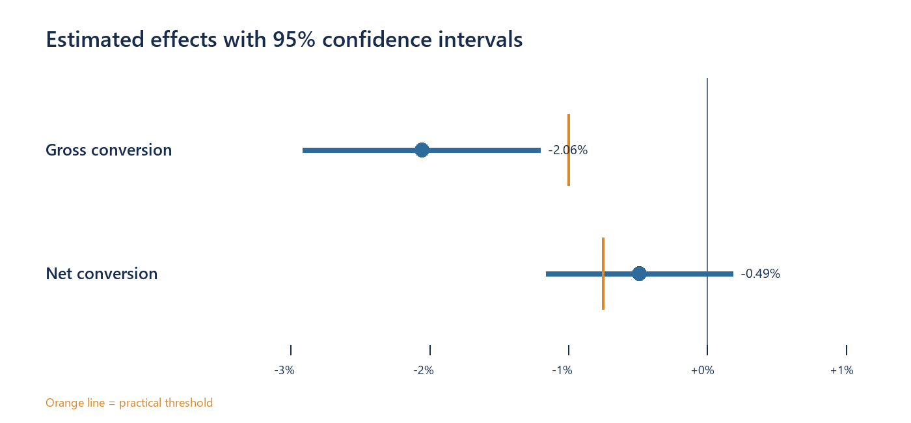
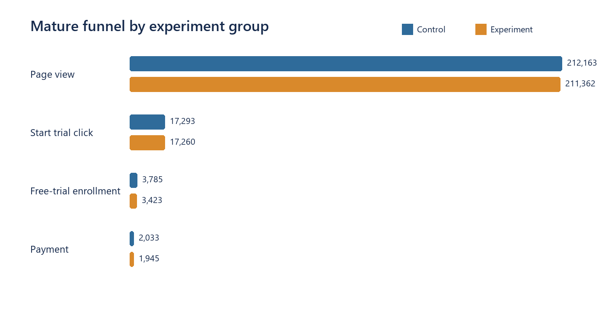

# Udacity Free-Trial Readiness Screener A/B Test

## Business question

Should Udacity launch the free-trial readiness screener to reduce low-intent enrollments without materially harming paid conversion?

## Answer

Udacity tested a readiness screen shown after a user clicked **Start Free Trial**. Users planning to study fewer than five hours per week were advised to use the free course materials, although they could still continue to the trial.

The screen reduced free-trial enrollment by **2.06 percentage points**, exceeding the practical target of 1 percentage point. However, the experiment did not demonstrate that paid conversion was protected: the 95% confidence interval for net conversion crossed the **-0.75 percentage-point guardrail**.

**Decision: do not launch yet.** Continue the experiment to the planned sample size or test a less restrictive message.

## Method

- **Control:** existing free-trial flow.
- **Experiment:** readiness question after the free-trial click.
- **Success metric:** gross conversion, enrollments divided by mature trial clicks.
- **Guardrail:** net conversion, payments divided by mature trial clicks.
- **Diagnostic:** retention, payments divided by enrollments.

Enrollment and payment outcomes require a 14-day maturity window. Traffic checks use all 37 experiment days, while conversion metrics use the first 23 mature days in each group.

## Analysis workflow

### 1. Combine the experiment groups

The two source files represent the control and experiment groups of the same A/B test. They are loaded, labeled, and combined into one daily analysis table.

```python
control = load_group("control.csv", "Control")
experiment = load_group("experiment.csv", "Experiment")

frame = pd.concat(
    [control, experiment], ignore_index=True
).sort_values(["event_date", "experiment_group"])
```

**Output:** 74 daily rows: 37 days for each group. The input checks also confirm unique group-date rows, non-negative funnel counts, and 23 mature outcome days per group.

### 2. Build comparable funnel metrics in SQL

Only dates with complete enrollment and payment outcomes contribute to the decision metrics. Gross and net conversion use mature trial clicks as the common denominator.

```sql
SELECT
    experiment_group,
    SUM(CASE WHEN enrollments IS NOT NULL THEN clicks ELSE 0 END) AS mature_clicks,
    SUM(enrollments) AS enrollments,
    SUM(payments) AS payments,
    1.0 * SUM(enrollments)
        / SUM(CASE WHEN enrollments IS NOT NULL THEN clicks ELSE 0 END) AS gross_conversion,
    1.0 * SUM(payments)
        / SUM(CASE WHEN payments IS NOT NULL THEN clicks ELSE 0 END) AS net_conversion
FROM experiment_daily
GROUP BY experiment_group;
```

**Output:** one comparable funnel summary for Control and Experiment. This prevents the final 14 days, whose outcomes have not matured, from biasing conversion rates.

### 3. Estimate the treatment effect

For each proportion, the analysis calculates the Experiment-minus-Control difference and a two-sided 95% confidence interval.

```python
difference = experiment_rate - control_rate
pooled = (success_c + success_e) / (total_c + total_e)
standard_error = math.sqrt(
    pooled * (1 - pooled) * (1 / total_c + 1 / total_e)
)
ci_low = difference - 1.96 * standard_error
ci_high = difference + 1.96 * standard_error
```

The result is then compared with the pre-defined practical thresholds: **-1.00 pp** for gross conversion and **-0.75 pp** for the net-conversion guardrail.

The complete, executed walkthrough is available in [`notebooks/udacity_ab_test.ipynb`](notebooks/udacity_ab_test.ipynb). The reusable implementation is in [`scripts/build_analysis.py`](scripts/build_analysis.py), with the SQL model in [`sql/01_create_model.sql`](sql/01_create_model.sql).

## Findings

| Metric | Control | Experiment | Difference | 95% CI | Rule | Status |
|---|---:|---:|---:|---:|---:|---|
| Gross conversion | 21.89% | 19.83% | -2.06 pp | [-2.91, -1.20] pp | below -1.00 pp | Pass |
| Net conversion | 11.76% | 11.27% | -0.49 pp | [-1.16, +0.19] pp | above -0.75 pp | Fail |
| Retention | 53.71% | 56.82% | +3.11 pp | [+0.81, +5.41] pp | diagnostic only | Not a launch criterion |



The screen clearly filters trial enrollments. The paid-conversion estimate remains too uncertain to rule out meaningful downside.

## Funnel evidence



The treatment is introduced after the trial click, so mature clicks are the common denominator for gross and net conversion. The observed sample contains **34,553 of 54,826 required mature clicks**, or approximately **63%** of the planned information.

## Recommendation

Do not launch the screen to all users yet.

1. Continue the test until the required number of mature clicks is reached, or test a less restrictive message.
2. Launch only if gross conversion meets the success target and the lower confidence bound for net conversion stays above the guardrail.
3. Treat the increase in retention as diagnostic because enrollment is affected by the treatment.

## Repository structure

```text
data/raw/          Original control and experiment files
data/processed/    Combined and modeled analysis data
data/powerbi/      Compact Power BI input tables
notebooks/         Executed analysis notebook
sql/               SQLite model and analysis queries
scripts/           Reproducible build scripts
outputs/charts/    Final analytical figures
powerbi/project/   Power BI Project (PBIP)
```

## Reproduce

```bash
pip install -r requirements.txt
python scripts/build_analysis.py
python scripts/build_charts.py
python scripts/build_notebook.py
python scripts/build_powerbi_project.py
```

To open the dashboard, open `powerbi/project/UdacityABTest.pbip`, set the `DataFolder` parameter to the local `data/powerbi` directory, and refresh the model.

## Data and tools

The experiment data comes from the [Udacity A/B Testing course](https://www.udacity.com/course/ab-testing--ud257). The raw CSV files were retrieved from a [public dataset mirror](https://github.com/zyellieyan/AB-Testing-Project). Tools: SQL (SQLite), Python, Jupyter Notebook, and Power BI.

## Limitations

- Enrollment and payment metrics use only the first 23 days with mature outcomes.
- The observed sample reached about 63% of the planned mature-click requirement.
- Daily aggregate data does not support user-level segment analysis.
- Retention is conditional on enrollment and is therefore diagnostic, not a launch criterion.
